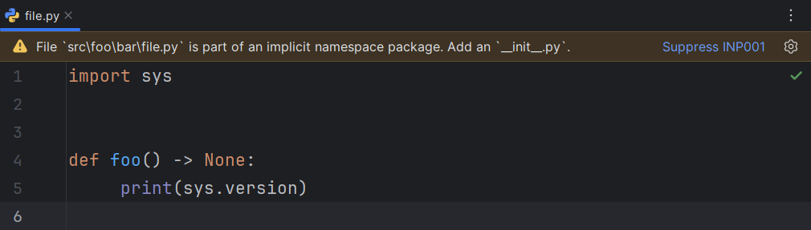
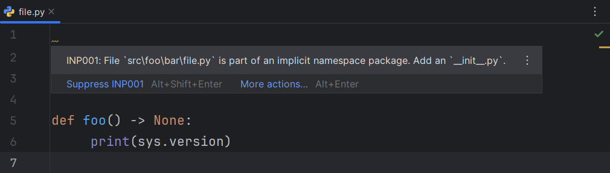

## Executable

The Ruff executable to be used for all operations.

If it is not provided, RyeCharm will attempt
to find one in the following order:

* The `ruff` executable found under Rye's `self` environment.
* Any `ruff` executable found in PATH.
* Any `ruff` executable found in the project's virtual environment.

## Cross-platform executable resolution

If this option is enabled and the executable is specified
as a relative path, it will be resolved against the project's
interpreter directory with its extension removed.

This is useful if Ruff is a development dependency
and is expected to always be installed,
regardless of the user's platform.

## Configuration file

If specified, this file will be passed to Ruff on every invocation.

This corresponds to the `--config` command-line option
and the [`configuration`][1] language server setting.

## Running mode

The manner in which the executable is invoked.

Default: <i>Command line</i>

!!! info "See <i>[Running modes][2]</i> for more information."

## Main functionalities

### Linting

Whether [linting errors][3] (diagnostics) should be shown.

This corresponds to the [`lint.enable`][4] language server setting.

Default: `true`

!!! info "See <i>[Linting][5]</i> for more information."

#### Report syntax errors

Whether diagnostics for syntax errors should be shown.

This corresponds to the [`showSyntaxErrors`][6] language server setting.

Default: `false`

#### Show editor banner for file-level diagnostics

Whether diagnostics for the entire file (e.g., [`INP001`][7])
should be shown at the very top of the editor for that file as a banner.

Default: `false`

=== "Enabled"
    

=== "Disabled"
    

#### Tooltip format

The format in which tooltips are displayed.

Default: <i>A123: Message</i>

=== "Message"
    

=== "A123: Message"
    

=== "Ruff (A123): Message"
    

=== "Message Ruff(A123)"
    

### Quick fixes

Whether [quick fixes][8] (code actions) should be suggested.

Default: `true`

#### Fix all safely fixable violations

Whether a quick fix to fix all safely fixable violations should be suggested.

This corresponds to the [`fixAll`][9] language server setting.

Default: `true`

#### Organize imports

Whether a quick fix to organize the imports section should be suggested.

This corresponds to the [`organizeImports`][10] language server setting.

Default: `true`

#### Disable rule for line

Whether a quick fix to disable a given rule
for the current line should be suggested.

This corresponds to the [`codeAction.disableRuleComment.enable`][11]
language server setting.

Default: `true`

#### Fix single violation

Whether a quick fix specific to the current violation should be suggested.

This corresponds to the [`codeAction.fixViolation.enable`][12]
language server setting.

Default: `true`

### Formatting

Whether [Ruff's formatter][13] should be used
instead of the IDE's default formatter.

Default: `true`

!!! info "See <i>[Formatting][14]</i> for more information."

#### Run on reformat

Whether the <i>Reformat Code</i> action should trigger Ruff.

Default: `true`

#### Run on optimize imports

Whether the <i>Optimize Imports</i> action should trigger Ruff.

Default: `true`

### Documentation popups

Whether [documentation popups][15] should be shown.

Default: `true`

!!! info "See <i>[Documentation][16]</i> for more information."

#### For rule codes in `noqa` comments

Whether documentation popups should be shown when
<code>noqa</code> codes in Python comments are hovered.

Default: `true`

#### For rule codes in TOML files

Whether documentation popups should be shown when
rule codes in rule selector arrays are hovered.

Default: `true`

#### For setting keys in TOML files

Whether documentation popups should be shown when
the keys of the `tool.ruff` table in the `pyproject.toml` file
(or top-level keys for `ruff.toml`/`.ruff.toml`) are hovered.

Default: `true`

### Log level

The amount of logs the language server will emit.

This corresponds to the [`logLevel`][17] language server setting.

Default: <i>Information</i>

### Log file

The file to which the logs will be written.

This corresponds to the [`logFile`][18] language server setting.

## Run on save

Whether Ruff should be run on files before saving.

If both "fix problems" and "format" are enabled, they are run in that order.

### Project files only

Whether only files belong to the current project should be run on.

Default: `true`

### Format

Whether Ruff should format the file before it is saved.

Default: `false`

### Fix violations

Whether Ruff should try to fix all safely fixable violations
in the file before it is saved.

Default: `false`

## Other settings

### Suggest executable

Whether RyeCharm should automatically find a potential
Ruff executable and suggest setting that as the executable
for the current project on some events.

This feature can also be [triggered as an action][19].

#### On project open

Whether a potential executable should be suggested when a project is opened.

Default: `true`

#### On packages change

Whether a potential executable should be suggested when
a package is installed via the <i>Python Packages</i> toolwindow.

Default: `true`

## Advanced settings

### Automatically restart servers on configuration change

Whether the running servers should be restarted immediately
when the <i>Apply</i>/<i>OK</i> buttons are clicked.

Default: `true`

  [1]: https://docs.astral.sh/ruff/editors/settings/#configuration
  [2]: ../ruff/running-modes.md
  [3]: https://docs.astral.sh/ruff/editors/features/#diagnostic-highlighting
  [4]: https://docs.astral.sh/ruff/editors/settings/#lint_enable
  [5]: ../ruff/linting.md
  [6]: https://docs.astral.sh/ruff/editors/settings/#showsyntaxerrors
  [7]: https://docs.astral.sh/ruff/rules/implicit-namespace-package/
  [8]: https://docs.astral.sh/ruff/editors/features/#code-actions
  [9]: https://docs.astral.sh/ruff/editors/settings/#fixall
  [10]: https://docs.astral.sh/ruff/editors/settings/#organizeimports
  [11]: https://docs.astral.sh/ruff/editors/settings/#disablerulecommentenable
  [12]: https://docs.astral.sh/ruff/editors/settings/#fixviolationenable
  [13]: https://docs.astral.sh/ruff/editors/features/#formatting
  [14]: ../ruff/formatting.md
  [15]: https://docs.astral.sh/ruff/editors/features/#hover
  [16]: ../ruff/documentation.md
  [17]: https://docs.astral.sh/ruff/editors/settings/#loglevel
  [18]: https://docs.astral.sh/ruff/editors/settings/#logfile
  [19]: ../ruff/actions.md#suggest-project-executable
