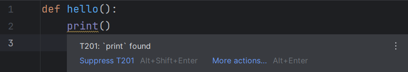
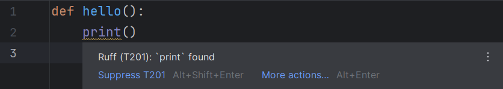
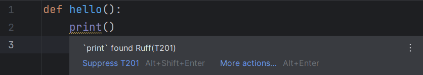

## Executable

The Ruff executable to be used for all operations.

If it is not provided, RyeCharm will attempt
to find one in the following order:

* The `ruff` executable found under Rye's `self` environment.
* Any `ruff` executable found in PATH.
* Any `ruff` executable found in the project's virtual environment.

## Cross-platform executable resolution

If this option is enabled, the executable will be resolved against
the project's interpreter directory, with its extension removed.

This is useful if Ruff is a development dependency
and is expected to always be installed,
regardless of the user's platform.

## Configuration file

If specified, this file will be passed to Ruff on every invocation.

This corresponds to the `--config` command-line option
and the [`configuration`][1] language server setting.

## Running mode

The manner in which [linting diagnostics][2] are provided.

Default: <i>Command line</i>

## Tooltips

### Tooltip format

The format in which tooltips are displayed.

Default: <i>A123: Message</i>

=== "Message"
    

=== "A123: Message"
    

=== "Ruff (A123): Message"
    

=== "Message Ruff(A123)"
    

## Formatting

Settings in this group controls [the events][3]
on which Ruff's formatter is triggered.

### On save

Whether files should be formatted by Ruff before saving.

Default: `true`

### On save, but only project files

Whether only files belong to the current project should be formatted by Ruff.

Default: `true`

### On reformat

Whether the <i>Reformat Code</i> action should trigger Ruff.

Default: `true`

### On optimize imports

Whether the <i>Optimize Imports</i> action should trigger Ruff.

Default: `true`

## Documentation

This group controls the behaviour of [documentation popups][4].

### For `noqa` codes

Whether documentation popups should be shown when
<code>noqa</code> codes in Python comments are hovered.

Default: `true`

### For TOML keys

Whether documentation popups should be shown when
the keys of the `tool.ruff` table in the `pyproject.toml` file
(or top-level keys for `ruff.toml`/`.ruff.toml`) are hovered.

Default: `true`

## Language server settings

Some of these settings' values are passed to Ruff as
language server [initialization options][5].

### Automatically restart servers on configuration change

Whether the running servers should be restarted immediately
when the <i>Apply</i>/<i>OK</i> buttons are clicked.

Default: `true`

### Hover support

Whether the language server's [hover support][6] should be used.

Default: `true`

### Formatting support

Whether the language server's [formatting support][7] should be used.

Default: `true`

### Diagnostics support

Whether the language server's [linting support][8] should be used.

Default: `true`

### Show diagnostics for syntax errors

Whether syntax error diagnostics should be shown.

This corresponds to the [`showSyntaxErrors`][9] language server setting.

Default: `false`

### Code actions support

Whether the language server's [quick fix support][10] should be used.

Default: `true`

### Fix all problems in one action

Whether the [`source.fixAll`][11] code action should be used.

This corresponds to the [`fixAll`][12] language server setting.

Default: `true`

### Organize imports

Whether the [`source.organizeImports`][11] code action should be used.

This corresponds to the [`organizeImports`][13] language server setting.

Default: `true`

### Suppress rules

Whether the code action to suppress a problem should be used.

This corresponds to the [`codeAction.disableRuleComment.enable`][14]
language server setting.

Default: `true`

### Fix problems

Whether the code action corresponding to
the quick fix for a problem should be used.

This corresponds to the [`codeAction.fixViolation.enable`][15]
language server setting.

Default: `true`

### Log level

Controls the amount of logs
the language server will emit.

This corresponds to the [`logLevel`][16] language server setting.

Default: <i>Information</i>

### Log file

The file to which the logs will be written.

This corresponds to the [`logFile`][17] language server setting.

## Other settings

### Suggest executable

Whether RyeCharm should automatically find a potential
Ruff executable and suggest setting that as the executable
for the current project on some events.

See also [the corresponding action][18].

#### On project open

Whether a potential executable should be suggested when a project is opened.

Default: `true`

#### On packages change

Whether a potential executable should be suggested when
a package is installed via the <i>Python Packages</i> toolwindow.

Default: `true`

  [1]: https://docs.astral.sh/ruff/editors/settings/#configuration
  [2]: ../ruff/linting.md
  [3]: ../ruff/formatting.md
  [4]: ../ruff/documentation.md
  [5]: https://docs.astral.sh/ruff/editors/settings/
  [6]: https://docs.astral.sh/ruff/editors/features/#hover
  [7]: https://docs.astral.sh/ruff/editors/features/#formatting
  [8]: https://docs.astral.sh/ruff/editors/features/#diagnostic-highlighting
  [9]: https://docs.astral.sh/ruff/editors/settings/#showsyntaxerrors
  [10]: https://docs.astral.sh/ruff/editors/features/#code-actions
  [11]: https://microsoft.github.io/language-server-protocol/specifications/lsp/3.17/specification/#textDocument_codeAction
  [12]: https://docs.astral.sh/ruff/editors/settings/#fixall
  [13]: https://docs.astral.sh/ruff/editors/settings/#organizeimports
  [14]: https://docs.astral.sh/ruff/editors/settings/#disablerulecommentenable
  [15]: https://docs.astral.sh/ruff/editors/settings/#fixviolationenable
  [16]: https://docs.astral.sh/ruff/editors/settings/#loglevel
  [17]: https://docs.astral.sh/ruff/editors/settings/#logfile
  [18]: ../ruff/actions.md#suggest-project-executable
