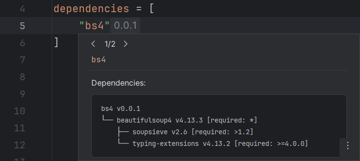

## Executable

The uv executable to be used for all operations.

If it is not provided, RyeCharm will attempt
to find one in the following order:

* The `uv` executable found under Rye's `uv` subdirectory.
* Any `uv` executable found in PATH.
* Any `uv` executable found in the project's virtual environment.

## Configuration file

If specified, this file will be passed to uv on every invocation.

This corresponds to the `--config-file` command-line option.

## Main functionalities

### Show dependency tree popups

Whether dependency trees should be shown (in the form of documentation popups)
when a dependency specifier is hovered.

Default: `true`

!!! info "See <i>[Documentation][1]</i> for more information."

#### Show version specifiers

Whether version specifiers should be shown
next to each package node in dependency trees.

This corresponds to the `--show-version-specifiers` command-line option.

Default: `true`

=== "Enabled"
    

=== "Disabled"
    

#### Show latest versions

Whether the latest version should be shown next to each package node
in dependency trees if the installed version is not latest.

This corresponds to the `--outdated` command-line option.

Default: `false`

=== "Enabled"
    

=== "Disabled"
    

#### Hide duplicated subtrees

Whether dependency subtrees that have already been shown should be shown again.

This corresponds to the `--no-dedupe` command-line option.

Default: `true`

#### Max depth

The maximum depth of the dependency trees.

This corresponds to the `--depth` command-line option.

Default: 255

#### Show inverted tree first

Whether the tree that displays the current package's dependants
should be shown first.

Default: `false`

  [1]: ../uv/documentation.md#dependency-trees
