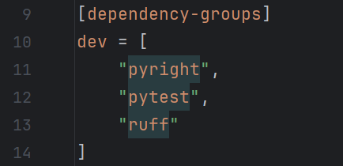
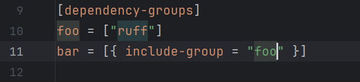
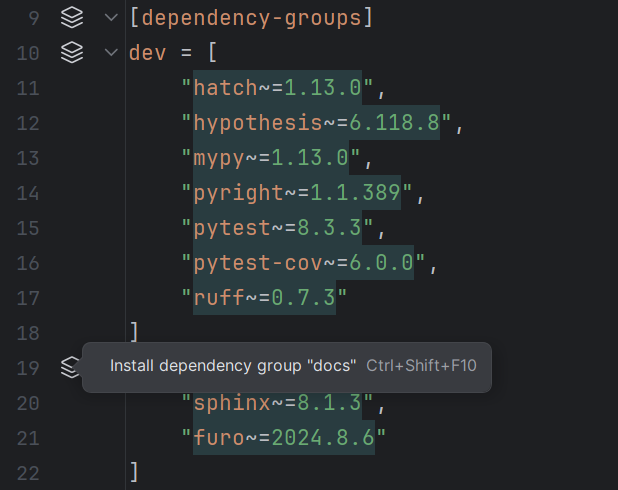

## File icons

In the [<i>Project</i> tool window][1], [editor tabs][2], [navigation bar][3]
and various other places, the icons for the following files
are replaced with the tools' logos:

* Ruff: `ruff.toml`/`.ruff.toml`
* uv: `uv.toml`, `uv.lock`
* Rye: `.rye/config.toml`

<figure markdown="1">
  <figcaption><i>Project</i> tool window:</figcaption>
  
</figure>

<figure markdown="1">
  <figcaption>Editor tabs:</figcaption>
  
</figure>

<figure markdown="1">
  <figcaption>Navigation bar:</figcaption>
  
</figure>

## New terminal autocompletion

If the [new terminal][4] is used,
autocompletion will be provided for `ruff`, `uv`, `uvx` and `rye` commands.

## Language injection

### Inline script metadata block

[PEP 723][5] inline script metadata blocks
are automatically injected with TOML.
Only Python files whose extensions are
either `.py` or unknown are supported.

This can be disabled using [the corresponding setting][6].
To force rerendering, make an arbitrary edit or reopen the file.

### Requirements arrays in TOML files

uv settings that takes an array of [PEP 508][7] dependencies
are injected with <i>Requirements</i>,
similar to [that of `project.dependencies`][8].
Such settings include:

* \[`tool.uv`] `constraint-dependencies`
* \[`tool.uv`] `dev-dependencies`
* \[`tool.uv`] `override-dependencies`
* \[`tool.uv`] `upgrade-package`
* \[`tool.uv`] `pip.upgrade-package`
  
`project.optional-dependencies` and `dependency-groups` are also supported.
This monkeypatches [PY-71120][9].

=== "pyproject.toml"
    

=== "uv.toml"
    

### Edit script metadata fragment

This intention is available when the cursor
is inside the script metadata block.

It opens a new editor with the fragment content prefilled,
removing all prefixes and suffixes.
The new content will be written back when this editor is closed.

=== "Python file"
    

=== "New editor"
    

### Installed version inlay hints

In `pyproject.toml` and `uv.toml` files,
elements of dependency specifier arrays
will have inlay hints displayed next to them,
showing the currently installed versions.

This applies to the following arrays
(configurable using <b>Settings</b> | <b>Inlay Hints</b> |
<i>Other</i> | <i>TOML</i> | <i>Dependency versions</i>):

* `project.dependencies` (default: enabled)
* `project.optional-dependencies.*` (default: enabled)
* `build-system.requires` (default: disabled)
* `dependency-groups.*` (default: enabled)
* \[`tool`] `uv.constraint-dependencies` (default: disabled)
* \[`tool`] `uv.dev-dependencies` (default: enabled)
* \[`tool`] `uv.override-dependencies` (default: disabled)
* \[`tool`] `uv.upgrade-package` (default: disabled)
* \[`tool`] `uv.pip.upgrade-dependencies` (default: disabled)

This is equivalent to running `uv pip list` at the project's path
with the corresponding interpreter as argument, if any.

!!! note

    On IntelliJ IDEA, flickering might happen during computation.
    The cause of this problem is as of yet unknown.
    
    As a workaround, enable the "Retrieve data for computing dependency version
    inlay hints in read action" advanced setting in the <i>uv</i> subpanel.

    This workaround has the disadvantage of delaying
    the computation of other inlay hint providers,
    causing a "synchronous execution under read action" exception.
    Unless the delay proves to be a problem, you can safely ignore this warning.

### Dependency groups

[PEP 735][10] dependency groups are supported
using a number of features.

#### Language injection

See [&sect; <i>Requirements arrays in TOML files</i>][11].

#### References finding

On focus, an included group's name will be highlighted
along with that group's declaration and vice versa.

#### One-click-install via line markers

Dependency groups can be installed
using their corresponding icons in the gutter.
The icon corresponding to the `[dependency-groups]`
table header installs all groups.

This is equivalent to running `uv sync --group ...`/`uv sync --all-groups`
at the project's path.

#### Inspection

Errors will be reported for a dependency group if:

* It includes an invalid group.
* It includes itself.
* It has the same [normalized name][12] as another group.

  [1]: https://www.jetbrains.com/help/pycharm/project-tool-window.html
  [2]: https://www.jetbrains.com/help/pycharm/settings-editor-tabs.html#Settings_Editor_Tabs.topic
  [3]: https://www.jetbrains.com/help/pycharm/part-4-using-the-navigation-bar.html
  [4]: https://blog.jetbrains.com/idea/2024/02/the-new-terminal-beta-is-now-in-jetbrains-ides/
  [5]: https://peps.python.org/pep-0723/
  [6]: ./configurations/main.md#pep-723-inline-script-metadata-blocks
  [7]: https://peps.python.org/pep-0508/
  [8]: https://www.jetbrains.com/help/pycharm/pyproject-toml-support.html#specify-project-dependencies
  [9]: https://youtrack.jetbrains.com/issue/PY-71120
  [10]: https://peps.python.org/pep-0735/
  [11]: #requirements-arrays-in-toml-files
  [12]: https://packaging.python.org/en/latest/specifications/name-normalization/
