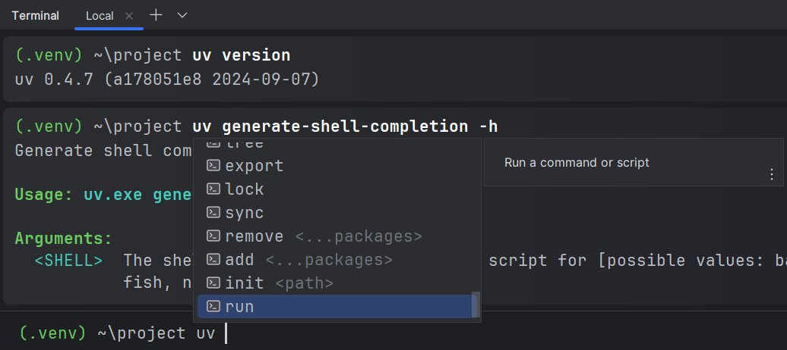

## File icons

In the [<i>Project</i> tool window][1], [editor tabs][2], [navigation bar][3]
and various other places, the icons for the following files
are replaced with the tools' logos:

* Ruff: `ruff.toml`/`.ruff.toml`
* uv: `uv.toml`, `uv.lock`
* Rye: `.rye/config.toml`

<figure markdown="1">
  <figcaption><i>Project</i> tool window:</figcaption>
  
</figure>

<figure markdown="1">
  <figcaption>Editor tabs:</figcaption>
  
</figure>

<figure markdown="1">
  <figcaption>Navigation bar:</figcaption>
  
</figure>

## New terminal autocompletion

If the [new terminal][4] is used,
autocompletion will be provided for `ruff` and `uv` commands.

  [1]: https://www.jetbrains.com/help/pycharm/project-tool-window.html
  [2]: https://www.jetbrains.com/help/pycharm/settings-editor-tabs.html#Settings_Editor_Tabs.topic
  [3]: https://www.jetbrains.com/help/pycharm/part-4-using-the-navigation-bar.html
  [4]: https://blog.jetbrains.com/idea/2024/02/the-new-terminal-beta-is-now-in-jetbrains-ides/
