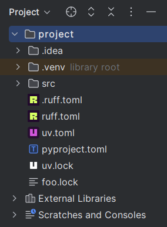
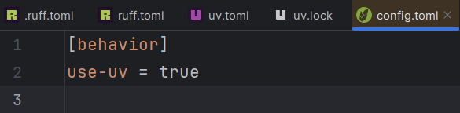
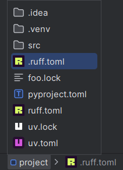
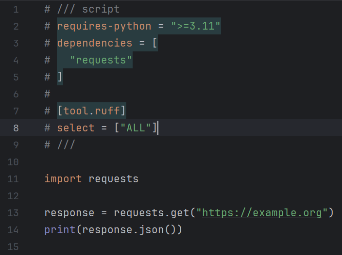
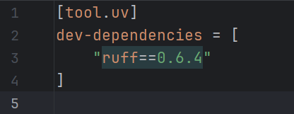
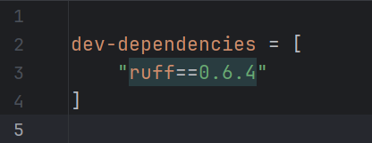
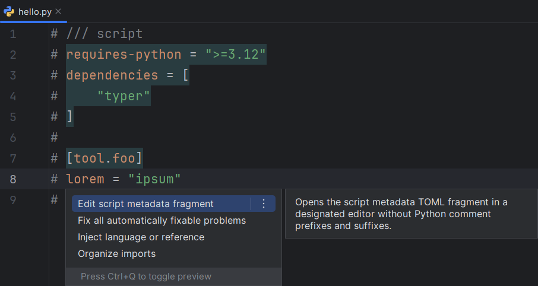
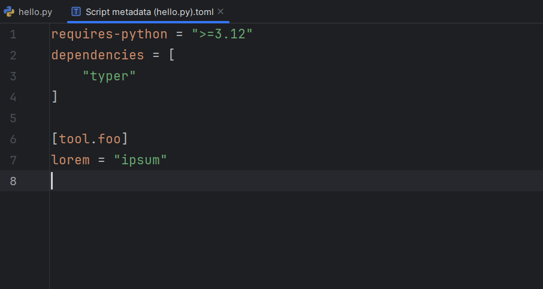

## File icons

In the [<i>Project</i> tool window][1], [editor tabs][2], [navigation bar][3]
and various other places, the icons for the following files
are replaced with the tools' logos:

* Ruff: `ruff.toml`/`.ruff.toml`
* uv: `uv.toml`, `uv.lock`
* Rye: `.rye/config.toml`

<figure markdown="1">
  <figcaption><i>Project</i> tool window:</figcaption>
  
</figure>

<figure markdown="1">
  <figcaption>Editor tabs:</figcaption>
  
</figure>

<figure markdown="1">
  <figcaption>Navigation bar:</figcaption>
  
</figure>

## New terminal autocompletion

If the [new terminal][4] is used,
autocompletion will be provided for `ruff`, `uv`, `uvx` and `rye` commands.

## Language injection

### Inline script metadata block

[PEP 723][5] inline script metadata blocks
are automatically injected with TOML.
Only Python files whose extensions are
either `.py` or unknown are supported.

This can be disabled using [the corresponding setting][6].
To force rerendering, make an arbitrary edit or reopen the file.

### Requirements arrays in TOML files

uv settings that takes an array of [PEP 508][7] dependencies
are injected with <i>Requirements</i>,
similar to [that of `project.dependencies`][8].
Such settings include:

* \[`tool.uv`] `constraint-dependencies`
* \[`tool.uv`] `dev-dependencies`
* \[`tool.uv`] `override-dependencies`
* \[`tool.uv`] `upgrade-package`
* \[`tool.uv`] `pip.upgrade-package`
  
`project.optional-dependencies` is also supported.
This monkeypatches [PY-71120][9].

=== "pyproject.toml"
    

=== "uv.toml"
    

### Edit script metadata fragment

This intention is available when the cursor
is inside the script metadata block.

It opens a new editor with the fragment content prefilled,
removing all prefixes and suffixes.
The new content will be written back when this editor is closed.

=== "Python file"
    

=== "New editor"
    

  [1]: https://www.jetbrains.com/help/pycharm/project-tool-window.html
  [2]: https://www.jetbrains.com/help/pycharm/settings-editor-tabs.html#Settings_Editor_Tabs.topic
  [3]: https://www.jetbrains.com/help/pycharm/part-4-using-the-navigation-bar.html
  [4]: https://blog.jetbrains.com/idea/2024/02/the-new-terminal-beta-is-now-in-jetbrains-ides/
  [5]: https://peps.python.org/pep-0723/
  [6]: ./configurations/main.md#pep-723-inline-script-metadata-blocks
  [7]: https://peps.python.org/pep-0508/
  [8]: https://www.jetbrains.com/help/pycharm/pyproject-toml-support.html#specify-project-dependencies
  [9]: https://youtrack.jetbrains.com/issue/PY-71120
