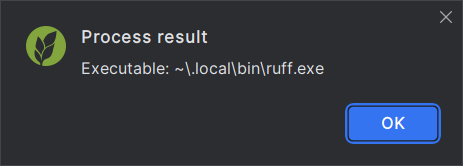

## Clean cache

Remove all `.ruff_cache` directories in the project recursively.

This is equivalent to running `ruff clean` at the project's path.

## Clear plugin cache

[Documentation popups][1] are prerendered and cached.
While the cache is automatically invalidated whenever the executable changes,
manually clearing it might sometimes be useful.

## Open configuration file

Open the global Ruff configuration file (`ruff.toml`/`.ruff.toml`)
in the editor.

## Show executable

Show the Ruff executable that would be used for the project,
or, when the action is not triggered in a project context,
the global Ruff executable.

## Show linters

Show a table of upstream linters that Ruff supports.

This is equivalent to running `ruff linter`.

## Show version

Display a message showing the version of the current Ruff executable.

This is equivalent to running `ruff version`.

## Suggest project executable

Find a potential executable and suggest
setting it as the Ruff executable for the current project,
even if one is already specified.

In most cases, this is not necessary, since the plugin
will detect such executables automatically.

  [1]: documentation.md
