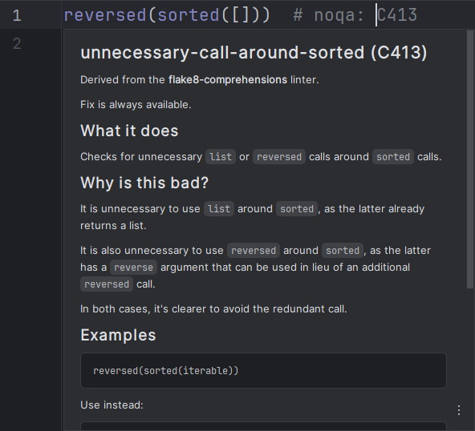
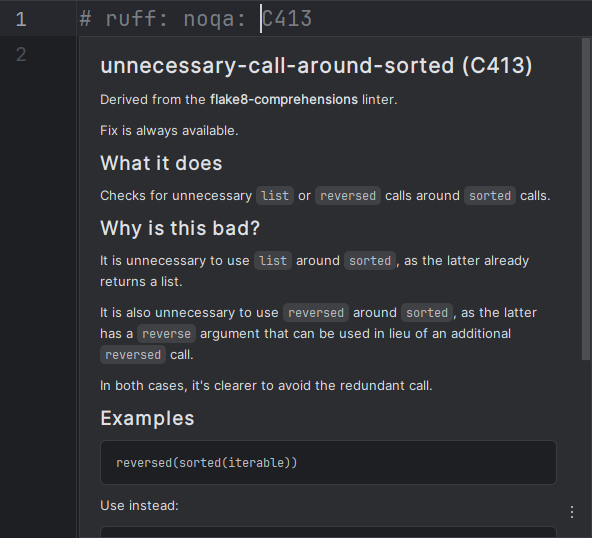
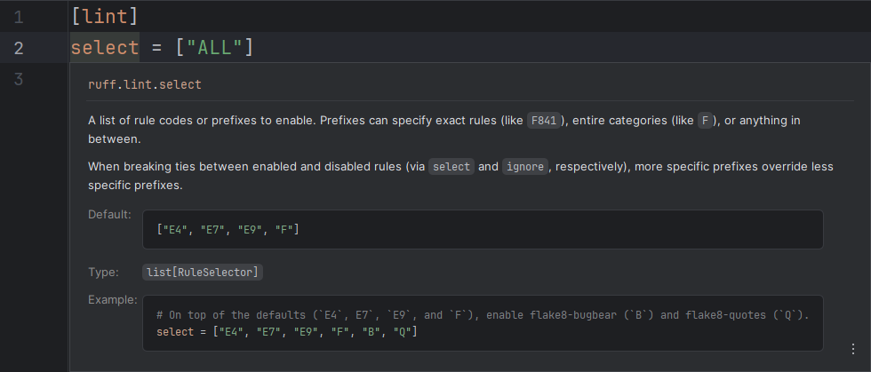

On hover or <i>Quick Documentation</i> (<kbd>Ctrl</kbd> + <kbd>Q</kbd>),
RyeCharm will show documentation popups for the currently selected symbol
if it is a recognized one.

## `noqa` rules

Rule documentation popups are shown for rule codes
in `# noqa` comments of both line and file-level.

This is equivalent to running `ruff rule ...` with the rule code as argument.

=== "Line-level"
    

=== "File-level"
    

## TOML keys

Configuration option documentation popups are shown for
keys of the `[tool.ruff]` table of `pyproject.toml` (or a subtable thereof)
and all keys in `ruff.toml`/`.ruff.toml`.

This is equivalent to running `ruff config ...`
with the option name as argument.

=== "`pyproject.toml`"
    

=== "`ruff.toml`"
    
