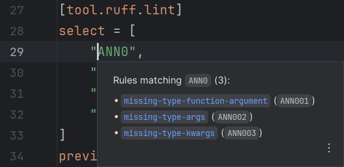

On hover or <i>Quick Documentation</i> (++ctrl+q++),
RyeCharm will show documentation popups for the currently selected symbol
if it is a recognized one.

## Rule selectors

Rule documentation popups are shown for rule codes
in `# noqa` comments of both line and file-level
as well as the following TOML settings:

* (`lint`) `extend-fixable`
* (`lint`) `extend-ignore`
* (`lint`) `extend-per-file-ignores.*`
* (`lint`) `extend-safe-fixes`
* (`lint`) `extend-select`
* (`lint`) `extend-unfixable`
* (`lint`) `extend-unsafe-fixes`
* (`lint`) `fixable`
* (`lint`) `ignore`
* (`lint`) `per-file-ignores.*`
* (`lint`) `select`
* (`lint`) `unfixable`

This is equivalent to running `ruff rule ...` with the rule code as argument.

=== "Line-level comment"
    

=== "File-level comment"
    

=== "Rule selector array"
    

=== "Rule selector array &ndash; prefix"
    

## TOML setting keys

Configuration option documentation popups are shown for
keys of the `[tool.ruff]` table of `pyproject.toml` (or a subtable thereof)
and keys in `ruff.toml`/`.ruff.toml`.

This is equivalent to running `ruff config ...`
with the key's name as argument.

=== "`pyproject.toml`"
    

=== "`ruff.toml`"
    

## Link resolving

Links to Ruff options and rules are resolved in-place.

In other words, clicking on such a link will replace the current popup content
with that option or rule's documentation.
