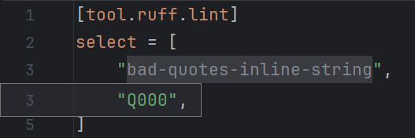
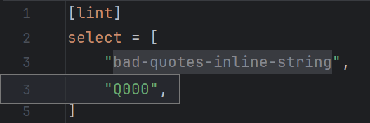
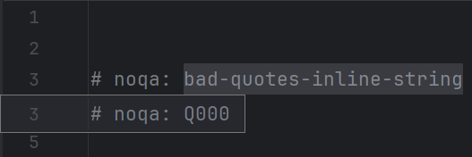

[Code folding][1], also known as <i>code collapsing</i>,
replaces a piece of source code with arbitrary content.

This is commonly used to display a contracted version of function bodies
and similar blocks, but it can be used for other purposes as well.

## Single-rule selectors

A single-rule selector is one that corresponds to exactly one rule.

Since Ruff selectors can only be either rule codes or code prefixes,
"folding" selectors into the names of the rules they represent
can help with readability.

=== "`pyproject.toml`"
    

=== "`ruff.toml`"
    

=== "`# noqa` comments"
    

## Known problems

### Data dependency

The folding builder works by relying on data retrieved from `ruff rule --all`.
Most of the time, this information is read from the plugin's cache.

When a project is opened for the first time, the necessary information
might not be available yet, in which case the folding builder
will ask a new thread to collect this data <em>for its next run</em>.
This means no selectors will be made foldable in that run.

The process will likely complete in less than one second,
after which applicable selectors can be folded manually.

!!! tip
    As a workaround, all such selectors can be folded collectively
    by triggering <i>Collapse All</i> (++ctrl+shift+minus++)
    followed by <i>Expand All</i> (++ctrl+shift+plus++).

### Reload latency

Due to how the IDE works, selectors may not be foldable right after a change
that does not directly modify the TOML strings.

!!! tip
    To enforce reloading, change the selector string in some way
    (e.g., add a space to the end of it), then revert that change.

### Quick documentation

When hovered over, a folded region will always display the expanded content.
Thus, rule documentation will not be shown if the selector is folded.

!!! tip
    To trigger [rule documentation popups][2] on a folded selector,
    either move the cursor to the quotes, which do not belong to the folded region,
    or use the <i>Quick Documentation</i> action (++ctrl+q++).

  [1]: https://www.jetbrains.com/help/pycharm/working-with-source-code.html#code_folding
  [2]: documentation.md#rule-selectors
