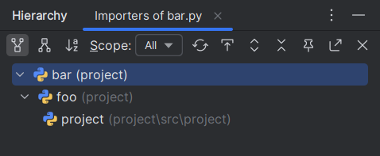
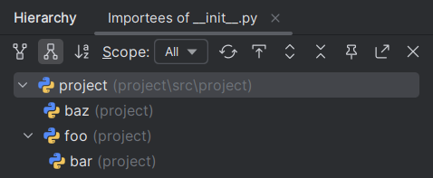

When <i>Call Hierarchy</i> is triggered on a Python file directly
(e.g., via <i>Project</i> tool window),
the import graph will be displayed in the <i>Hierarchy</i> tool window.

To switch between the importers and importees view,
use the two corresponding action in the tool bar.

This is equivalent to running `ruff analyze graph ...` with the file as input.

=== "Importers"
    

=== "Importees"
    

This feature is disabled by default.
It can be enabled using an advanced setting in the <i>Ruff</i> panel.

!!! note
    Due to technical limitations, the feature might cause the IDE
    to raise "Synchronous execution under `ReadAction`" errors.
    These errors are log-only and affect neither the feature nor the IDE itself.
