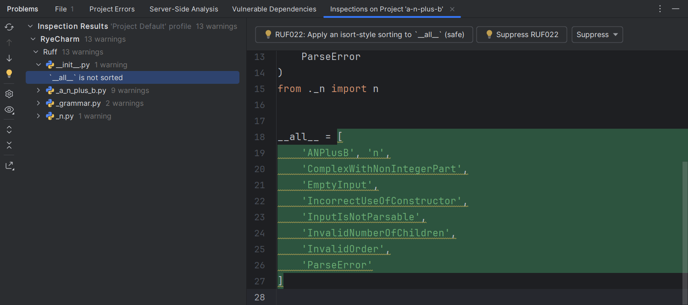

## In-editor

There are two types of linting diagnostics:
Lint errors (each of which corresponds to [a rule][1]) and syntax errors.
The latter is [not reported by default][2],
as it is expected that the same errors are already reported by the IDE.

### <i>Command line</i> mode

In <i>Command line</i> mode, the executable is invoked after every keystroke.

This is equivalent to running `ruff check --no-fix` with the file as input.

### LSP modes

In LSP modes, diagnostics are sent to the client via
[`textDocument/publishDiagnostics`][3] notifications.

## Batch inspection

RyeCharm also supports running Ruff using <i>[Inspect Code...][4]</i>,
also known as <i>batch inspection mode</i>.

This is equivalent to running `ruff check` at the project directory.

!!! warning
    If there are unsaved changes, the returned diagnostics may be out-of-date.

  [1]: https://docs.astral.sh/ruff/rules/
  [2]: ../configurations/ruff.md#report-syntax-errors
  [3]: https://microsoft.github.io/language-server-protocol/specifications/lsp/3.17/specification/#textDocument_publishDiagnostics
  [4]: https://www.jetbrains.com/help/pycharm/running-inspections.html#run-all-inspections
