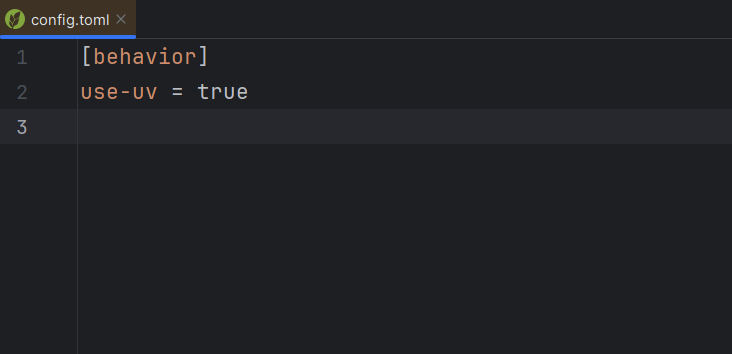
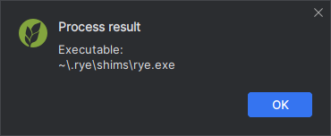
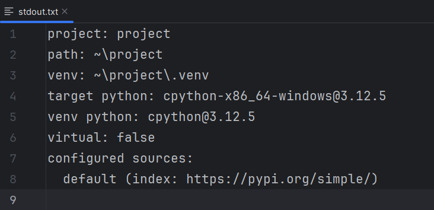

## Open configuration file

Open the global Rye configuration file in the editor.

This corresponds to `rye config --show-path`.

## Show executable

Show the Rye executable that would be used for the project,
or, when the action is not triggered in a project context,
the global Rye executable.

## Show project information

Open a new editor tab prefilled with the project's information.

This is equivalent to running `rye show` at the project's path.

