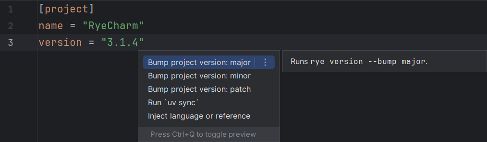
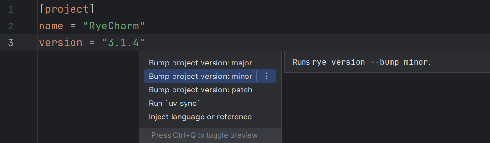
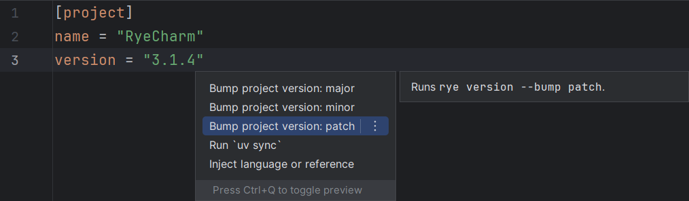

## Bump project version

The three intentions of this type
(for major, minor and patch bumping types)
are available in a `pyproject.toml` file.

This is equivalent to running `rye version --bump ...` at the project's path.

=== "Major"
    

=== "Minor"
    

=== "Patch"
    
