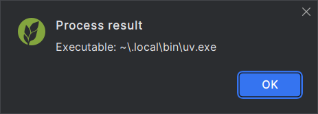
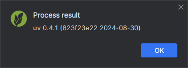

## Show executable

Show the uv executable that would be used for the project,
or, when the action is not triggered in a project context,
the global uv executable.

## Show version

Display a message showing the version of the current uv executable.

This is equivalent to running `uv self version`.

