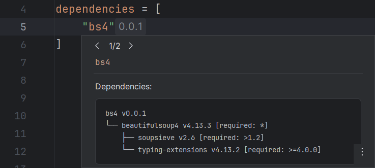
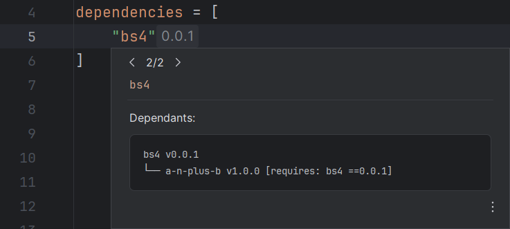

On hover or <i>Quick Documentation</i> (++ctrl+q++),
RyeCharm will show documentation popups for the currently selected symbol
if it is a recognized one.

## Dependency trees

When the following keys in `pyproject.toml`/`uv.toml` are hovered,
RyeCharm will show dependency trees for the package in question:

* `project.dependencies`
* `project.optional-dependencies.*`
* `build-system.requires`
* `dependency-groups.*`
* \[`tool`] `uv.constraint-dependencies`
* \[`tool`] `uv.dev-dependencies`
* \[`tool`] `uv.override-dependencies`
* \[`tool`] `uv.upgrade-package`
* \[`tool`] `uv.pip.upgrade-package`

Two trees will be shown:
One for the package's dependencies and one for its dependants.

This is equivalent to running `uv pip tree --package ... [--inverted]`
with the package as argument.

=== "Dependencies"
    

=== "Dependants"
    
