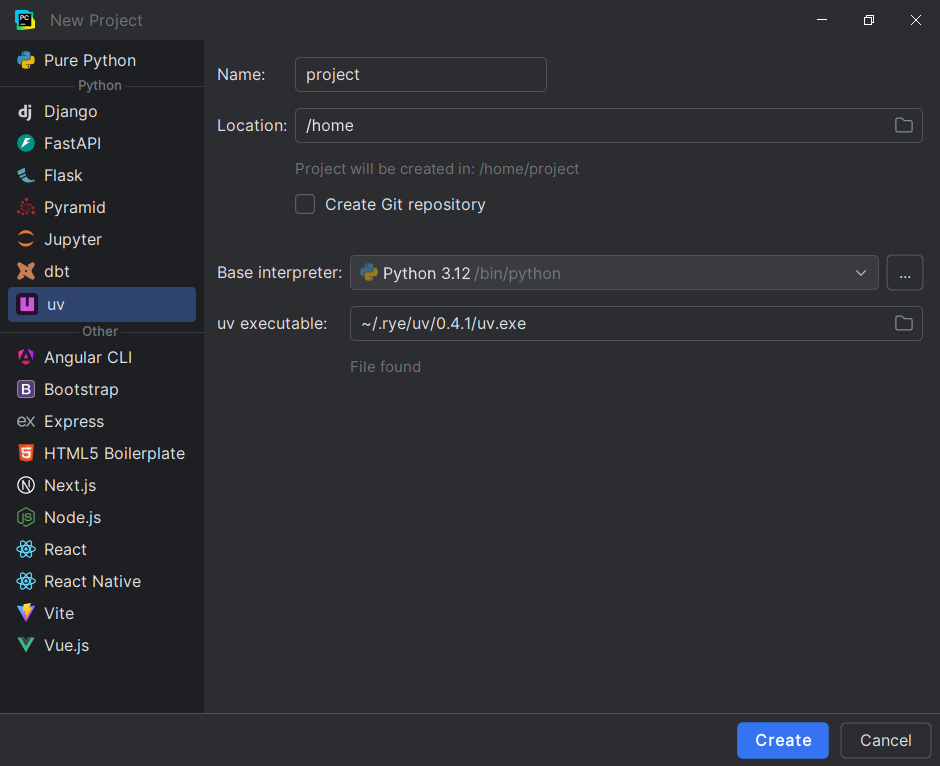

In the <i>New Project</i> dialog,
there will be an <i>uv</i> option on the left column.

This panel has the same basic functionalities
as [the default (<i>Pure Python</i>) panel][1].

!!! note
    Due to technical limitations, it is currently
    not possible to extend the standard panel.
    The <i>uv</i> panel cannot be used with existing framework panels.
    This is expected to change in PyCharm 2024.3.

## Settings

### Basic fields

The <i>Name</i> field specifies the new IntelliJ project name
and the name of the directory in which it will be created.

The <i>Location</i> specifies the directory which the new directory
will be created as a child of.

The <i>Create Git repository</i> specifies whether
a Git repository should be created for this new project.

These fields work the same as their counterparts in [the standard panel][1].

### Base interpreter

The interpreter to be passed to `uv init` and `uv venv`.

This corresponds to the `--python` command-line option.

### uv executable

The uv executable to be used for the generation process.
It will be saved as the global executable once the process is completed.

### Distribution name

The name to be used in [the `project.name` field in `pyproject.toml`][2].
This name must match the regular expression
`(?i)^([A-Z0-9]|[A-Z0-9][A-Z0-9._-]*[A-Z0-9])$`.

### Project kind

The kind of the project you want to create.

* App: Corresponds to `--app`.
* Library: Corresponds to `--lib`.
* Packaged app: Corresponds to `--app --package`.

Default: *App*

### Create `README.md`

Whether a `README.md` should be created for the new project.

This corresponds to the `--no-readme` command-line option.

Default: `true`

### Pin Python

Whether the minimum Python version should be pinned.

This corresponds to the `--no-pin-python` command-line option.

Default: `true`

  [1]: https://www.jetbrains.com/help/pycharm/creating-empty-project.html
  [2]: https://packaging.python.org/en/latest/specifications/name-normalization/#name-format
