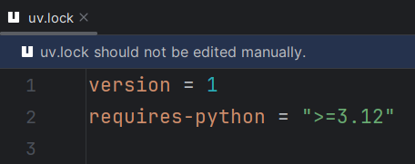

## Editing `uv.lock`

When `uv.lock` is edited, an editor-level notice is shown.

`uv.lock` is meant to be generated by `uv`;
manualy changes will be overwritten in subsequent runs.
The file therefore should not be edited manually.

## Usages of `tool.uv.dev-dependencies`

As of uv 0.4.27, which added support for [PEP 735][1],
this field is obsoleted in favor of the <code>dev</code> dependency group.
It will eventually be deprecated and removed.

More information can be found in [uv's documentation][2].

  [1]: https://peps.python.org/pep-0735/
  [2]: https://docs.astral.sh/uv/concepts/dependencies/#legacy-dev-dependencies
