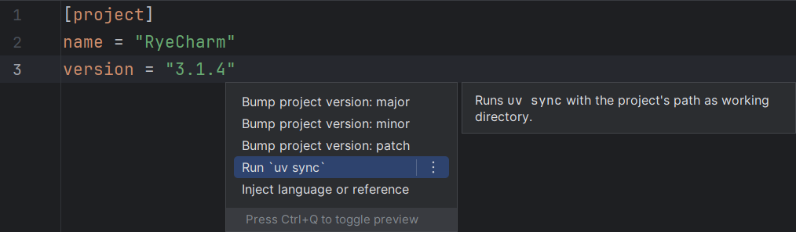

## Synchronize project

This intention is available in a `pyproject.toml` file.
It does not modify the file, but trigger a subprocess
that updates the project's environment.

This is equivalent to running `uv sync` at the project's path.

