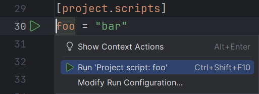

A <i>[run configuration][1]</i> defines something that can be executed.

RyeCharm provides a <i>uv</i> run configuration type,
which is available in the feature's standard dialog.

This type has multiple subpanels, also known as "factories",
by which uv run configurations can be defined.

## Custom task

Run an uv command with the given arguments
and environment at the specified working directory.

## Project script

Run a [project script][2] using `uv run`.

Run configurations of this kind can be automatically configured
using run line markers shown in `pyproject.toml` or
the corresponding actions in the menu when a subkey
of either `[project.scripts]` or `[project.gui-scripts]` is right-clicked.

## Global tool

Run a [global tool][3] using `uvx`/`uv tool run`.

  [1]: https://www.jetbrains.com/help/pycharm/run-debug-configuration.html
  [2]: https://packaging.python.org/en/latest/specifications/pyproject-toml/#entry-points
  [3]: https://docs.astral.sh/uv/guides/tools/
