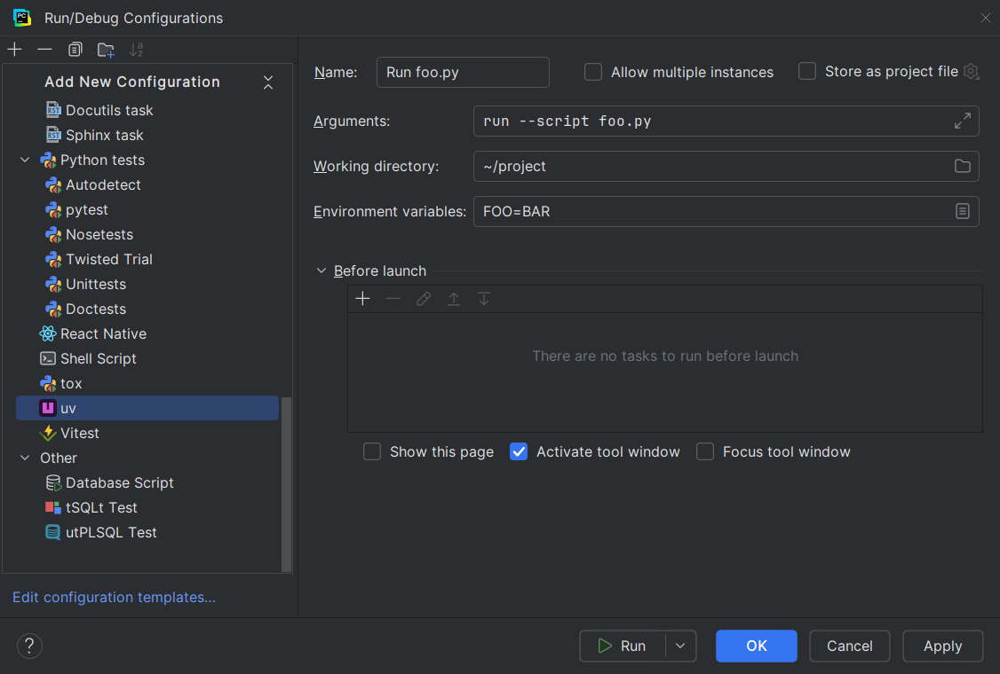

A <i>[run configuration][1]</i> defines something that can be executed.

RyeCharm provides a <i>uv</i> run configuration type,
which is available in the feature's standard dialog.

This type has multiple subpanels, also known as "factories",
by which uv run configurations can be defined.
For now, only one factory is supported.

## Custom task

The "Custom task" factory simply runs an uv command with the given arguments
and environment at the specified working directory.

  [1]: https://www.jetbrains.com/help/pycharm/run-debug-configuration.html
